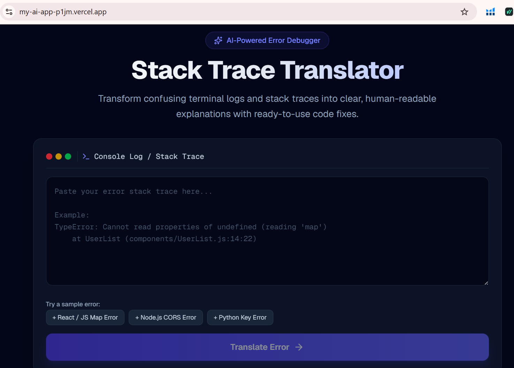
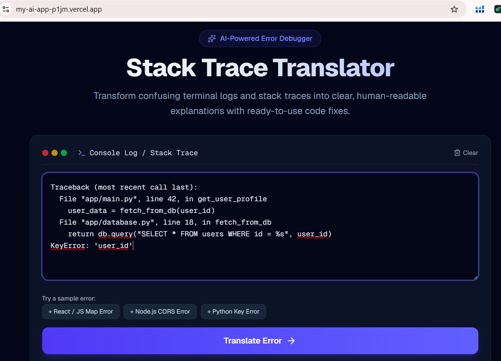
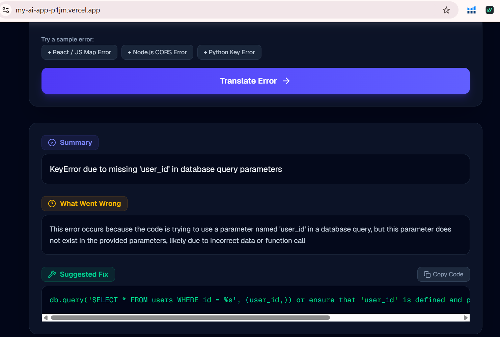

# Stack Trace Translator 🛠️

> An AI-powered developer tool that converts cryptic stack traces and error logs into actionable, human-readable explanations and fixes.

## 🔗 Live Demo
[View Live App on Vercel](https://my-ai-app-p1jm.vercel.app)

---

## 📌 Problem Statement & Target Audience
Developers—especially beginners and computer science students—frequently waste significant time deciphering obscure compiler errors and long framework stack traces. Standard error logs are often intimidating and hard to read.

**Stack Trace Translator** solves this by accepting raw error logs and translating them into step-by-step explanations, identifying the root cause, and providing ready-to-use code fixes.

---

## ✨ Features List
* **Multi-Language Error Parsing:** Supports JavaScript/TypeScript, Python, Java, and SQL stack traces.
* **Instant Plain-English Explanations:** Breaks down technical jargon into clear, digestible summaries.
* **Actionable Fix Suggestions:** Provides precise code snippets showing how to fix the issue.
* **Preset Sample Errors:** One-click sample error templates (React, Node CORS, Python) for fast testing.
* **Clean & Modern UI:** Dark-mode interface designed for high readability.

---

## 🤖 AI Feature & System Prompt

### AI Functionality
The app sends user-submitted error logs to the Groq API (Llama 3 / Mixtral models). It processes the log and formats the diagnostic breakdown structured into:
1. **Summary**
2. **What Went Wrong** (Root Cause Analysis)
3. **Suggested Fix** (Code Solution)

### System Prompt
```text
You are an expert software developer and developer advocate. 
Your task is to analyze developer stack traces and error logs.

When given an error trace:
1. Identify the programming language and framework.
2. Explain what the error means in clear, simple, concise English without unnecessary jargon.
3. Highlight the specific line or component causing the failure.
4. Provide a corrected code snippet showing exactly how to resolve the issue.

Keep explanations clear, supportive, and direct.
```
---

## 🛠️ Tech Stack & Services
* **Framework:** Next.js (React)
* **Styling:** Tailwind CSS
* **Deployment:** Vercel
* **Version Control:** GitHub
* **AI Provider:** Groq API

---

## 📸 App Screenshots

### 1. Landing Page


### 2. Stack Trace Input


### 3. AI Translation Output


---
Markdown
## 🚀 How to Run Locally
1. Clone the repository:
   git clone https://github.com/nabeerabukhari/my-ai-app.git

2. Navigate to the project directory:
   cd my-ai-app

3. Install dependencies:
   npm install

4. Set up Environment Variables:
   Create a .env.local file in the root directory:
   GROQ_API_KEY=your_groq_api_key_here

5. Run the development server:
   npm run dev

Open http://localhost:3000 in your browser.
